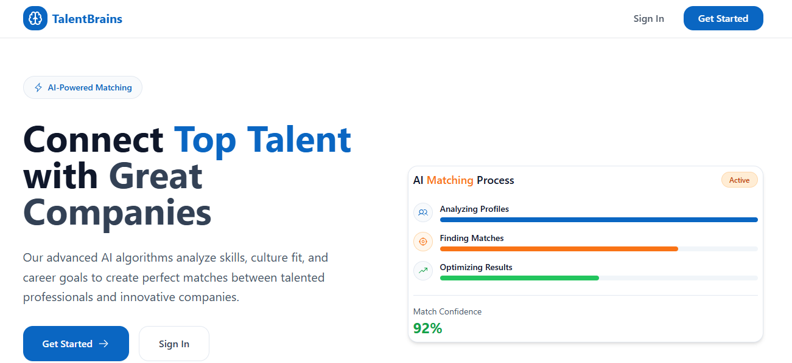

# 🧠 TalentBrains Platform

> AI-Powered Talent Acquisition Platform



## 📋 Overview

TalentBrains is a modern AI-powered talent acquisition platform that connects talented professionals with companies. The platform features intelligent job matching, application tracking, and comprehensive analytics for both talents and companies.

## 📁 Project Structure

```
talentbrains/
├── frontend/               # React + Vite + TypeScript
│   ├── src/
│   │   ├── assets/         # Static assets (images, logos)
│   │   ├── components/     # Reusable UI components
│   │   ├── pages/          # Page components
│   │   ├── hooks/          # Custom React hooks
│   │   ├── lib/            # Utilities & API clients
│   │   ├── services/       # API service layers
│   │   ├── stores/         # Zustand state management
│   │   ├── types/          # TypeScript type definitions
│   │   └── utils/          # Helper functions
│   ├── Dockerfile          # Frontend Docker config
│   ├── nginx.conf          # Nginx configuration
│   └── package.json        # Frontend dependencies
│
├── backend/                # Python + FastAPI
│   ├── app/
│   │   ├── api/            # API route handlers
│   │   ├── core/           # Core configurations
│   │   ├── models/         # Data models
│   │   ├── repositories/   # Data access layer
│   │   └── services/       # Business logic
│   ├── tests/              # Backend tests
│   ├── Dockerfile          # Backend Docker config
│   └── requirements.txt    # Python dependencies
│
├── docs/                   # Documentation & assets
├── docker-compose.yml      # Docker orchestration
├── .gitignore
└── README.md
```

## 🚀 Quick Start

### Prerequisites

- **Docker** & **Docker Compose** (for containerized deployment)
- **Node.js** >= 18.0.0 (for local frontend development)
- **Python** >= 3.10 (for local backend development)
- **Supabase Account** (for database and authentication)

### 🐳 Docker Deployment (Recommended)

1. **Clone the repository**
   ```bash
   git clone https://github.com/sohayb-elbakali/talentbrains-pro.git
   cd talentbrains
   ```

2. **Set up environment variables**
   - Copy `.env.example` files in both `frontend/` and `backend/` directories
   - Update with your Supabase credentials

3. **Build and start all services**
   ```bash
   docker-compose up -d
   ```

4. **Access the application**
   - Frontend: http://localhost:3000
   - Backend API: http://localhost:8000
   - API Docs: http://localhost:8000/docs

### 💻 Local Development

#### Frontend Setup

```bash
cd frontend
npm install
npm run dev
# Runs on http://localhost:3000
```

#### Backend Setup

```bash
cd backend
pip install -r requirements.txt
python main.py
# Runs on http://localhost:8000
```

## 🔧 Environment Variables

### Frontend (`frontend/.env.local`)

```env
VITE_SUPABASE_URL=your_supabase_url
VITE_SUPABASE_ANON_KEY=your_supabase_anon_key
VITE_API_URL=http://localhost:8000
```

### Backend (`backend/.env`)

```env
DATABASE_URL=your_database_url
SUPABASE_URL=your_supabase_url
SUPABASE_KEY=your_supabase_key
SUPABASE_SERVICE_ROLE_KEY=your_service_role_key
```

## 🛠️ Tech Stack

### Frontend
- **React 18** - UI Library
- **Vite** - Build tool & dev server
- **TypeScript** - Type safety
- **TailwindCSS** - Utility-first CSS framework
- **Zustand** - Lightweight state management
- **React Query** - Server state management
- **React Hook Form + Zod** - Forms & validation
- **React Router** - Client-side routing
- **Phosphor Icons** - Icon library

### Backend
- **FastAPI** - Modern Python web framework
- **Supabase** - Database & Authentication
- **Pydantic** - Data validation
- **Uvicorn** - ASGI server
- **Python 3.10+** - Programming language

### Infrastructure
- **Docker** - Containerization
- **Nginx** - Web server & reverse proxy
- **PostgreSQL** - Database (via Supabase)

## 🐳 Docker Commands

| Command | Description |
|---------|-------------|
| `docker-compose up -d` | Start all services in detached mode |
| `docker-compose up --build` | Rebuild images and start services |
| `docker-compose down` | Stop and remove all services |
| `docker-compose logs -f` | View live logs from all services |
| `docker-compose logs -f frontend` | View frontend logs only |
| `docker-compose logs -f backend` | View backend logs only |
| `docker-compose ps` | List running services |
| `docker-compose restart` | Restart all services |

## 📝 Development Scripts

### Frontend (`cd frontend`)

| Command | Description |
|---------|-------------|
| `npm run dev` | Start development server with hot reload |
| `npm run build` | Build for production |
| `npm run preview` | Preview production build locally |
| `npm run lint` | Lint code with ESLint |
| `npm run test` | Run tests |

### Backend (`cd backend`)

| Command | Description |
|---------|-------------|
| `python main.py` | Start development server with auto-reload |
| `uvicorn app.main:app --reload` | Alternative way to start dev server |
| `pytest` | Run all tests |
| `pytest tests/ -v` | Run tests with verbose output |

## ✨ Features

### For Talents
- 🎯 AI-powered job matching based on skills and experience
- 📊 Personalized dashboard with analytics
- 📝 Easy job application management
- 🔔 Real-time notifications
- 👤 Comprehensive profile management

### For Companies
- 🚀 Post and manage job listings
- 🤖 AI-powered talent matching
- 📈 Application tracking and analytics
- 💼 Company profile customization
- 📧 Candidate communication tools

## 🔐 Authentication

The platform uses Supabase for authentication, supporting:
- Email/Password authentication
- OAuth providers (Google, GitHub, etc.)
- Role-based access control (Talent/Company)
- Secure session management

## 📚 API Documentation

Once the backend is running, visit:
- **Swagger UI**: http://localhost:8000/docs
- **ReDoc**: http://localhost:8000/redoc

## �� Contributing

Contributions are welcome! Please feel free to submit a Pull Request.

## 📄 License

MIT © TalentBrains Team

## 📧 Contact

For questions or support, please contact the TalentBrains team.

---

**Built with ❤️ by the TalentBrains Team**
